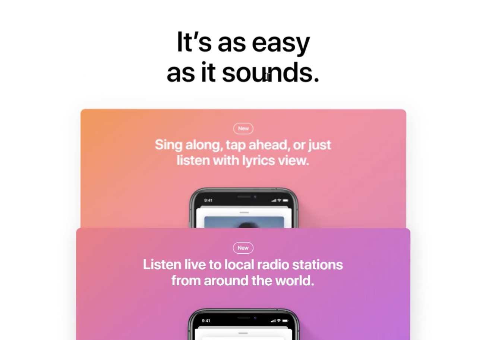
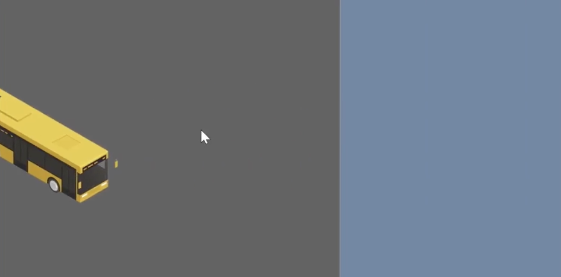
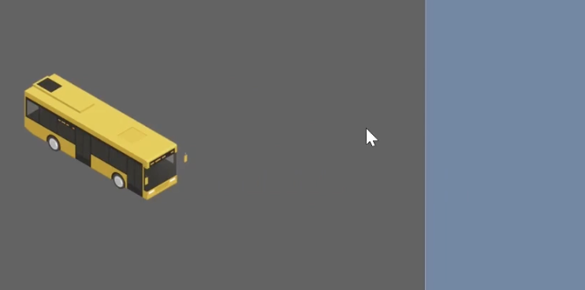

# JavaScipt 기초

<br />

{: .note }
`이벤트 버블링과 data-set` , 이벤트 리스너를 줄여야 램 사용을 줄일 수 있다.

<br />

> html 태그에 몰래 정보를 숨길 수 있다.   ex) `<li class="" data-작명="값">list</li>`


```html
<!-- data-set -->
<li class="tab-button" data-id="0">List</li>

<script>
    // data-set 데이터 가져오기
    document.querySelector('.tab-button').dataset.id
    // 0 출력
</script>
```

<br />

> data-set를 이용해서 탭 기능 만들기

```html
<ul class="list">
    <li class="tab-button" data-id="0">Products</li>
    <li class="tab-button" data-id="1">Infor</li>
    <li class="tab-button" data-id="2">Ship</li>
</ul>

<script>

// 이벤트 등록
document.querySelector('.list').addEventListener('click',function(e){
    openTab(e.target.dataset.id);
})

function openTab() {
    const tabButtons = document.querySelectorAll('.tab-button');
    const tabContents = document.querySelectorAll('.tab-content');
    for (let i = 0; i < 3; i++) {
        tabButtons[i].addEventListener('click', function () {
            for (let j = 0; j < tabButtons.length; j++) {
                tabButtons[j].classList.remove("orange");
            }
            this.classList.add('orange');
            for (let k = 0; k < tabContents.length; k++) {
                tabContents[k].classList.remove("show");
            }
            tabContents[i].classList.add('show');
        });
    }
}
</script>
```


<br />
<br />

---


{: .note }
`Select 다루기`

> select에서 셔츠를 선택했을때 아래 select나 보이는 예제
> input(event)은 input이 변경될 때 마다 호출되는 함수

<br />

```html
<form class="container my-5 form-group">
    <p>상품선택</p>
    <select class="form-select1 mt-2">
      <option>모자</option>
      <option>셔츠</option>
    </select>
    <select class="form-select2 mt-2 form-hide">
      <option>95</option>
      <option>100</option>
    </select>
</form>

<script>
//form-select1의 값이 셔츠일 때 select2의 form-hide 클래스 삭제
document.querySelector('.form-select1').addEventListener('input', function() {
  var value = document.querySelector('.form-select1').value;
  if (value === '셔츠') {
    document.querySelector('.form-select2').classList.remove('form-hide');
  }
});
</script>
```

<br />
<br />

---


{: .note }
`자바스크립트 태그 생성하기 (첫번째 방법)` 이방법이 성능은 가장 좋음

- `document.createElement` : 태그 생성
- `a.innerHTML` : 글자 삽입
- `a.classList.add()` : 클래스 삽입
- `document.querySelector("#test").appendChild(a);` : 부모 안 요소에 삽입

<br />

```html
<div id="test">
</div>

<script>
    //p 태그 생성
    let a = document.createElement('p')
    //글자 삽입
    a.innerHTML = 'hi';
    //클래스 삽입
    a.classList.add();
    //부모 요소 안에 삽입
    document.querySelector("#test").appendChild(a);
</script>
```


<br />

{: .note }
`자바스크립트 태그 생성하기 (두번째 방법)`

- `insertAdjacentHTML('beforeend', a);` : 맨 아래 태그 생성


<br />

```html
<div id="test">
</div>

<script>
  // 태그 생성
  var a = '<p>안녕</p>';
  //insertAdjacentHTML (beforeend : 맨아래) 생성
  document.querySelector('#test').insertAdjacentHTML('beforeend', a);
</script>
```


{: .important-title } 
> 객체에서의 반복문 <br />  for(var key in obj){
>  <br />   &nbsp; &nbsp;  console.log(obj[key])
>  <br />   &nbsp; &nbsp; console.log(key)
>  <br /> }


<br />
<br />

---

{: .note }
`ajax 통신` 서버와 데이터를 주고 받을때는 문자만 가능, json형식은 문자로 취급하기 때문에 통신이 가능하다. `fetch`로 데이터를 받아왔다면 `res.json()`으로 `array/object자료형식`으로 변환한다.


1. 데이터의 url 기재
2. GET , POST , PUT , DELETE 중 하나 메소드 선텍


<br />

> fetch 함수 예제

```js
fetch('https://...')
  .then(res => res.json())
  .then(function(data){
    console.log(data)
  })
  .catch(function(error){
    console.log('실패함')
  });
```

<br />
<br />

---

{: .note }
`array`에 자주 사용하는 (filter,map,sort)

- `sort()` : sort는 기본적으로 문자 정렬을 한다.
  - `sort((a,b)=> a - b)` : 숫자 오름 차순
  - a - b > 0  `A를 오른쪽`
  - a - b < 0  `B를 오른쪽`

<br />

> sort 함수의 작동원리

```js
let array = [1,2,3,5,6];
// a,b는 배열의 자료 ex) a=1 , b=2
// a - b가 양수면 a 오른쪽으로 보낸다. 큰 수를 오른쪽으로 보낸다.
// a - b가 음수면 b 오른쪽으로 보낸다. 작은 수를 왼쪽으로 보낸다.
// 모든 수를 다 대입한다.
array.sort((a,b) => a - b );

//object내에서 정렬
let arrays = [
    {id : 0, price: 70000, title: "one"},
    {id : 1, price: 80000, title: "two"},    
    {id : 2, price: 60000, title: "three"},    
]
arrays.sort((a-b) => a.price - b.price)


```

<br />

{: .important-title } 
filter 함수

```js
let array = [1,2,3,76,9];
let arrays = array.filter((a) => a < 4);
//4 이하인 값만 arrays에 남음 (xx원본 변형xx)

let arrayss = array.map((a) => a * 4);
//각각의 요소를 변형 시킬 수 있다. (xx원본 변형xx)
```

<br />
<br />


---

## DOM 

{: .important-title } 
`Document Object Model` 라는 의미이다. 자바스크립트는 html 태그를 이해 할 수 없기 때문에 브라우저는 html 페이지를 열 때 object형식으로 담아준다. 이 object형식을 document object라고 한다.

> 요약하자면 DOM이란 자바스크립트가 html에 대한 정보들을 object자료로 정리한 것을 dom이라고 부른다.

<br />

```js
<div style="color : red">안녕하세요</div>

// 자바스크립트가 이해할 수 있도록 object로 변환
// 자바스크립트가 HTML에 대한 정보들 (id, class, name, style, innerHTML 등)을
// object 자료로 정리한걸 DOM이라고 한다.
var document = {
  div1 : {
    style : {color : 'red'}
    innerHTML : '안녕하세요'
  }
}
```

<br />

{: .important-title } 
`브라우저`은 문서를 위에서 부터 읽으며 `Document Object Model(DOM)` 생성한다. 읽을때 마다 DOM에 추가해준다.

<br />

```html
<!-- 브라우저는 위에서 부터 dom를 만들어가는데 test이 아직 생성되지도 않았는데 호출한 것 -->
<!-- script가 맨아래 와야하는 이유-->

<script>
  document.getElementById('test').innerHTML = '안녕'
</script>

<p id="test">임시글자</p>
```

<br />

{: .important-title } 
`read` , `DOMContentLoaded` , `load` 를 이용해 자바스크립트 실행을 나중으로 미루는 방법

- `DOMContentLoaded` : DOM이 완성될 때 까지 잠시 기다림
- `load` : DOM , JS , CSS가 완성 될 때까지 기다림


<br />

```html

<!-- 이런식으로 코드를 수정하면 dom를 다 생성 후에 자바스크립트 함수가 실행된다. -->
<!-- DOMContentLoaded를 이용해서 자바스크립트 실행을 미루기 -->
<script>
  document.addEventListener('DOMContentLoaded', function() { 
    document.getElementById('test').innerHTML = '안녕'
  })


  window.addEventListener('load', function(){
  //document 안의 이미지, js 파일 포함 전부 로드가 되었을 경우 실행할 코드
})
</script>

<p id="test">임시글자</p>
```

<br />
<br />

---

## localStorage

{: .note }
`localStorage`, `sessionStroage` > 이름 : 값 형태로 저장가능 , `indexDB` : 구조환된 대용량 데이터 저장 , `cookie` : 유저 로그인 정보 , `cash Storage` : html , css , js를 저장하는 곳

- localStorage , sessionStroage : 용량 5mb 문자/숫자만 저장 가능
  - localStorage : 사이트 재접속 윺지
  - sesstionStorage : 사이트 나가면 자동 삭제

<br />

> localStorage 다루는 법

```js
localStorage.setItem('이름', 'kim') //자료저장하는법
localStorage.getItem('이름') //자료꺼내는법
localStorage.removeItem('이름') //자료삭제하는법

JSON.stringify([1,2,3]) // json변환
JSON.parse(num);        // 다시 배열 화
```

> localStorage 수정하는 법
```js
// 1. 자료를 꺼내고
// 2. 꺼낸 자료를 수정
// 3. 다시 로컬 스토리지에 넣음
let item = JSON.parse(localStorage.getItem("cart"));
item.push(item);
localStorage.setItem('cart',JSON.stringify(item));
```

<br />
<br />

---

## ScrollEvent 활용
{: .note }
scroll event 활용해서 스크롤 내림에 따라 카드 선명도 서서히 사라지는 이벤트 생성하기

- 2차 방정식 사용
  - 높이가 650일 땐 1로 opacity 선명도가 1 ( 1 = a * 650 + b )
  - 높이가 1150일 땐 0으로 opacity 선명도가 0 ( 0 = a * 1150 + b )

<br />

- 

```html
  <div class="card-box">
    
  </div>
  <div class="card-box">
    
  </div>


<script>
  //전체 스크롤이 움직일 때 마다 호출
window.addEventListener('scroll', function() {
  var 높이 = window.scrollY;

  // 높이가 650일 땐 1로 opacity 선명도가 1 ( 1 = a * 650 + b )
  // 높이가 1150일 땐 0으로 opacity 선명도가 0 ( 0 = a * 1150 + b )
  // 스크롤이 움직이며 선명도가 달라짐
  var y = -1 / 500 * 높이 + 115 / 50;
  document.querySelectorAll('.card-box')[0].style.opacity = y;
});
</script>
```

<br />
<br />

---
## e.clientX로 스와이프 기능 구현 (Hammer.js사용하면 click , touch 동시에 구현 가능)

{: .note }
마우스로 잡아 스와이프하는 기능 구현 <br /> `mousedown` , `mousemove` 두개의 이벤트로 마우스를 처음 찍었을때와 x축으로 이동한 거리를 알아낸다. 거리는 tranlateX로 이동시킨다.

- `mousedown` : 마우스를 눌렀을 때
- `mouseup` : 마우스를 땠을 때
- `mousemove` : 마우스를 움직였을 때
- `e.clientx` : 현재 마우스 좌표

<br />

- `touchstart` : 터치를 시작했을때
- `touchmove` : 터치하고 움직 였을 때
- `touched` : 터치하고 움직였을때
- `e.touch[0].client` : touchstart , touchmove 의 x좌표
- `e.changedTouches[0].client` : touched의 x좌표



<br />

```html
<div class="slide-container" style="overflow: hidden">
      <div class="slide-box">
        
      </div>
      <div class="slide-box">
        
      </div>
</div> 

<script>
let startPotin = 0;
let isClick = false;
const slideBox = document.querySelectorAll('.slide-box')[0];
const slideContainer = document.querySelector('.slide-container');

// 마우스 클릭을 했을 때 시작 위치
slideBox.addEventListener('mousedown', function(e) {
  startPotin = e.clientX;
  isClick = true;
});
// 마우스로 움직인 거리
slideBox.addEventListener('mousemove', function(e) {
  if (isClick === true) {
    // 마우스를 처음 클릭한 곳과 움직인 거리를 translateX로 이동한다.
    slideContainer.style.transform = `translateX(${e.clientX - startPotin}px)`;
  }
});
// 마우스를 때면 더이상 움직이지 않게 하기
document.addEventListener('mouseup', function() {
  isClick = false;
});
</script>
```

<br />
<br />

## 스와이퍼 
{: .note }
마우스를 땠을 때 다음 이미지로 자연스럽게 넘어가도록 코드 작성



```js
let startPoint = 0;
let isClick = false;
const slideBox = document.querySelectorAll('.slide-box')[0];
const slideContainer = document.querySelector('.slide-container');

//처음 클릭한 이미지 시작 위치 추적
slideBox.addEventListener('mousedown', function(e) {
  startPoint = e.clientX;
  isClick = true;
});

// 이미지 움직였을때 이미지 이동
slideBox.addEventListener('mousemove', function(e) {
  if (isClick === true) {
    slideContainer.style.transform = `translateX(${e.clientX - startPoint}px)`;
  }
});

// 마우스를 땠을때 자연스럽게 다음이미지를 보이도록 코드 작성
// slideContainer.style.transition 영구적으로 스타일이 붙어버리니 settimeout으로 스타일 제거
slideBox.addEventListener('mouseup', function(e) {
  isClick = false;

  if (e.clientX - startPoint < -100) {
    slideContainer.style.transition = 'all 0.5s';
    slideContainer.style.transform = 'translateX(-100vw)';
  } else {
    slideContainer.style.transition = 'all 0.5s';
    slideContainer.style.transform = 'translateX(0vw)';
  }
  
  setTimeout(() => {
    slideContainer.style.transition = 'none';
  }, 500);
});

```