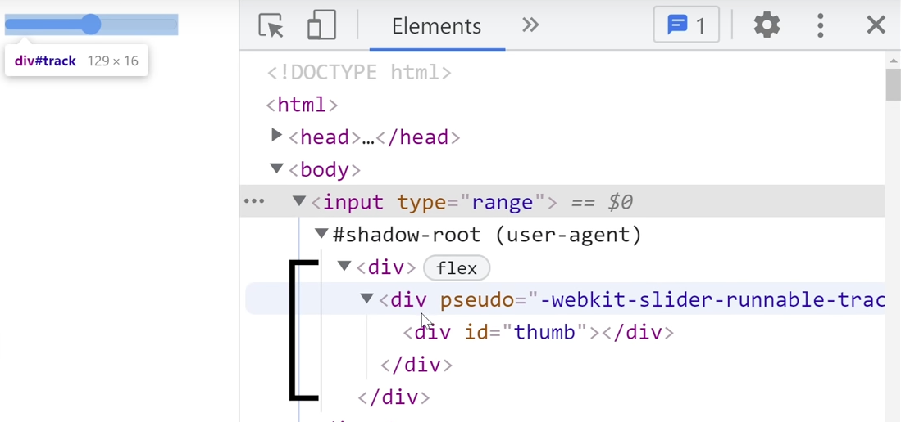
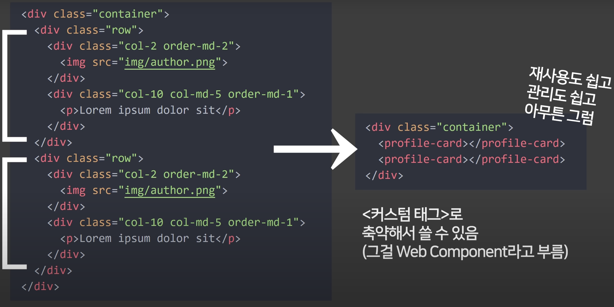
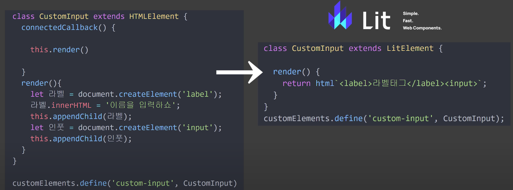
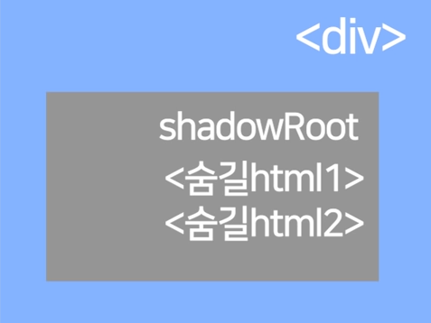
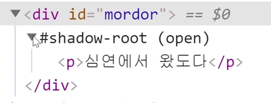
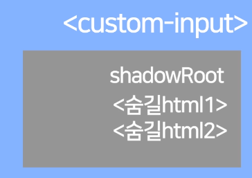

# JavaScipt Shadow Dom



{: .note } 
> -  `range`테그를 예를 들면 테그는 하나로 사용하지만 `Range` 태그안에는 여러가지 `div`를 이용해서 만들어진다. 여러 div를 각각 컨트롤하는 방법
> - `range` 태그는 실제로 3개의 태그로 이루어져 있다.

<br />
<br />

---

## Vanilla JS (component 만들기)



{: .new }
> - Vanilla JS로도 react 컴포넌트를 그대로 만들 수 있다. 아래는 라벨과 인풋을 하나의 커스텀 태그로 만드는 코드
> - `webComponent`라고 한다.
> - `customElements.define` 를 사용
> - `HTMLElement` > `connectedCallback` 함수에 html 컴포넌트 작성


<br />

```html

<body>


<custom-input />

<script>

class CustomInput extends HTMLElement {
  //connectedCallback 함수에다 html 작성한다.
  connectedCallback(){
    this.render();
  }

  // 랜더링 함수
  render(){
    let 라벨태그 = document.createElement('label');
    라벨태그.innerMTML = '이름을 입력하세요';
    this.appendChild(라벨태그);
    let 인풋 = document.createElement('input');
    this.appendChild(인풋);
  }

  //attribute가 변경감지하는 코드
  //name 프로퍼티가 변경되는 지 확인하는 코드
  static get observedAttributes(){
    return ['name']
  }

  //위에서 변경 감지되면 attributeChangedCallback 함수 실행
  attributeChangedCallback(){
    // 프로퍼티 name이 변경되면 자동으로 재랜더링 코드
    this.render();
    // ...
  }
}

// 컴포넌트 정의 ('커스텀 태그 명' , '위에서 정의한 클래스')
customElements.define('custom-input', CustomInput);
</script>
</body>

```

{: .important-title }
Lit이라는 라이브러리로 위 자바스크립트 코드를 좀 더 간편하게 사용가능 하다.

 


<br />
<br />

---

## shadow dom 만들기





{: .new }
> - 일반 html요소에 div요소를 집어넣기
>   - `showRoot안에 html요소를 숨길 수 있다.`
> - `attachShadow` : showRoot 열기

<br />

> 위 사용 예시

```html

<div id="mordor"></div>

<script>

//mordor 태그에 showdow 열기 (어둠의 공간 열기)
document.querySelector('#mordor').attachShadow({ mode : 'open'})
//mordor에 html 요소 넣기
//이제 <div id="mordor"></div> 태그를 사용하면 p 태그도 같이 return 된다.
document.querySelector('#mordor').shadowRoot.innerHTML = 
'<p>태그 넣기</p>'


</script>

```

<br />
<br />
<br />

## shadow Dom 과 web Component



{: .new }
> - `Webcomponent`에 Shadow Dom를 쓰면 좋다.
> - `shadow DOM`에 넣은 것은 외부의 영향을 받지 않는다.
> - `template` : 코드 임시 보관함
>   - 화면에 랜더링 되지 않는다.
>   - html 태그 임시 보관함

<br />

> html 모듈화 사용 예시 

```html
<body>

<custom-input></custom-input>

<template id="t1">
  <label>이름입력</label>
  <input><style>lable{color:red}</style>
</template>


<script>
class InputClass extends HTMLElement {
  connectedCallback(){
    //shadowRoot 열기
    this.attachShadow({mode: 'opne'})
    //template 임시보관함에 있는 코드를 불러옴
    this.shadowRoot.append(t1.content.cloneNode(true));
  }
}

customElements.defined("custom-input" , InputClass)
</script>

</body>
```