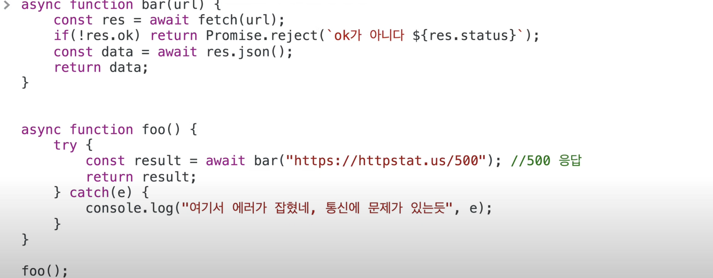
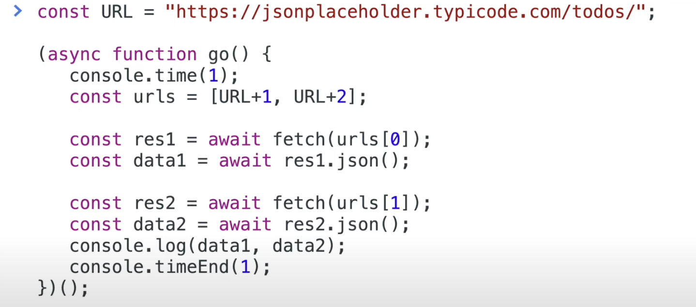
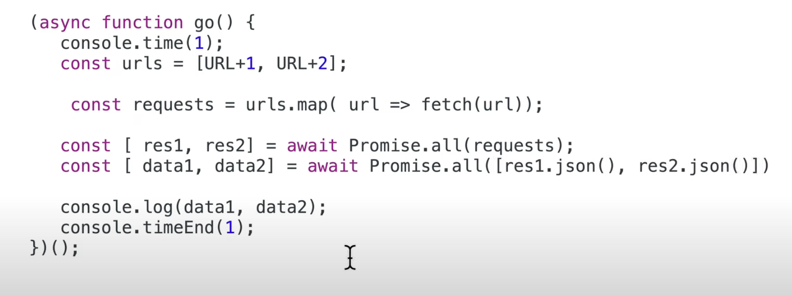

# 클린 코드 팁

## 여러 if문 줄이기
{: .note } 
여러 if문이 등장할 때 key - value값으로 코드를 좀 더 클린하게 작성 가능

<br />

> 다중 if문 없애기

```js
function executePayment(paymentType){
  if(paymentType === "KAKAO")
    return "카카오 결제 처리"
  if(paymentType === "NAVER")
    return "네이버 결제 처리"
  if(paymentType === "PAYCO")
    return "페이코 결제 처리"
  if(paymentType === "APPLE")
    return "애플 결제 처리"
}
```

<br />

{: .new } 
클린코드 적용 하기

```js
const paymentMap = {
  "KAKAO" : "카카오 결제 처리",
  "NAVER" : "네이버 결제 처리",
  "PAYCO" : "페이코 결제 처리",
  "APPLE" : "애플 결제 처리",
}

function executePayment(paymentType){
  return paymentMap[paymentType];
}

console.log(executePayment("KAKAO"))
```

<br />
<br />

---

## ## 여러 if문 줄이기 (안에 함수가 존재할 때)

{: .new } 
if문안에 함수가 있어도 똑같이 매핑관계를 이용할 수 있음

<br />


> 사용 예시

```js
function payKakao(){}
function payNaver(){}
function Payco(){}
function Apple(){}

function executePayment(paymentType){
  if(paymentType === "KAKAO")
    payKakao();
  if(paymentType === "NAVER")
    payNaver();
  if(paymentType === "PAYCO")
    Payco();
  if(paymentType === "APPLE")
    Apple();
}

executePayment("KAKAO")
```

> 클린 코드 적용 (객체 리터럴을 사용한 방식)

```js
function payKakao(){}
function payNaver(){}
function Payco(){}
function Apple(){}

// 매핑 관계
const paymentMap = {
  KAKAO_PAYMENT(){
    payKakao();
  }
  Naver_PAYMENT(){
    payNaver();
  }
  Payco_PAYMENT(){
    Payco();
  }
  Apple_PAYMENT(){
    Apple();
  }
}

// 비즈니스 함수 
function executePayment(paymentType){
  paymentMap[paymentType]();
}

//함수 호출
executePayment('KAKAO_PAYMENT')
```

<br />
<br />
<br />

---

## 이벤트 리스너에 화살표 함수 없애기

{: .new }
이벤트 리스너가 전달하는 함수에 변수를 전달 할 떄 화살표함수를 없이 구현하기


<br />

> 옳바르지 않은 코드 XXX

```js
const handler = (e , id) => {
  console.log(`${id} 여길 클릭했구나 ${e.offsetX}`)
}
// 클릭한 위치를 알려주는 함수
document.addEventListener("click", (e) => handler(e, 'jjehyun'))
```

> 옯바른 코드 OOO

```js
const handler = id => e => {
  console.log(`${id} 여길 클릭했구나 ${e.offsetX}`)
}
// 클릭한 위치를 알려주는 함수
document.addEventListener("click",  handler('jjehyun'))
```

<br />
<br />

{: .new }
> - curring를 이용한 예제
> - 함수를 가지고 다니면서 작업을 할 수 있다.
> - 함수의 실행이 나누어진 것 처럼 동작한다.

```js
const cache = (fn) => (a) => (b) => fn(a,b)
const add = (a,b) => a + b;

cache(add)('hello')('world');
//hellowworld

const helloFn = cache(add)('hello');
helloFn("월드")
//hello월드
helloFn("세상아")
//hello세상아
helloFn("신기")
//hello신기
```


<br />
<br />
<br />

## 에러 핸들링 패턴

{: .new }
> - `SyntaxError` : 문법 오류 
> - `TypeError` : 가지고 있지않는 프로퍼티, 메소드 호출
> - `ReferenceError` : 정의되지 않는 변수를 참조했을 때
> - ...

<br />


> 에러 핸들링 코드X (이코드는 에러와 동시에 코드의 흐름이 끊어지게 된다.)

```js
function addClass (els , className) {
  // 배열이 아닐때 에러 코드 전달
  if(!Array.isArray(els)) throw new Error("배열이 아님");
  // html 요소에 class를 추가로 넣어주는 코드
  els,forEach( el => el.classList.add(className))
}

//배열이 아닌 값 전달
addClass(document.body , "opacity100")
```

<br>

> 에러 핸들링 코드 O (`에러 반환을 해도 코드의 흐름이 끊어지지 않고 아래코드도 실행된다.`)

```js
function addClass (els , className) {
  // 배열이 아닐때 에러 코드 전달
  if(!Array.isArray(els)) throw new Error("배열이 아님");
  // html 요소에 class를 추가로 넣어주는 코드
  els,forEach( el => el.classList.add(className))
}
function bar (el){
  addClass(el, "hi");
}
function foo(){
  // trycatch문으로 에러를 받고, 코드의 흐름은 계속 된다.
  try{
    const el = document.querySelector("li");
    bar(el);
  } catch (e) {
    console.error("에러가 발생")
  }
}
foo();
console.log("foo가 에러를 반환해도 여기는 실행됨")
```

<br />
<br />

## 에러를 핸들링하는 상황

{: .highlight }
> - 항상 try-catch문을 사용하는 게 좋은 거는 아니다.
> - 예외적인 상황에서 하는게 좋다.
>   - 백엔드 통신 , ...

<br />

- 
- 

{: .warning }
> - `bar`함수에서 자동으로 error를 던저주는 게 아니라 에러를 직접 핸들링해 `bar`함수를 호출한 쪽에 에러를 던져주어야 한다.
> - `foo`함수를 `bar`함수에서 직접에러 핸들링한 코드를 받아와 보여주게 된다. 

<br />
<br />

## async await

- 
  - 직렬로 처리되어 속도가 느리다.
- 
  - 병렬로 처리되어 속도가 빠르다.


<br />
<br />
<br />

---

## ?? , || 연산자에 대해서 

{: .highlight }
> - `??` : 왼쪽이 null, undefind이면 오른쪽 출력
> - `||` : 왼쪽이 false이면 오른쪽 출력

<br />

> ?? , || 사용 예시

```js
console.log(null ?? "hi") // hi 출력
console.log(false ?? "hello") // hello 출력
```

<br />
<br />
<br />

---

## object 합치기

{: .highlight }
> - `Object`, `...` 이용하기

<br />

```js
//Good
const obj1 = Object.assign(item,detail);
//Better
const obj2 = {...item, ...detail, price:40};
```

<br />
<br />
<br />

---

## Optional Chaining 이용하기

{: .highlight }
> - OptionalChaining 이용하기

<br />

```js
//person.job이 있다면 title를 사용
//title값이 없다면 'No Job Yet' 출력
function displayJob(person){
  const title = person.job?.title ?? 'No Job Yet';
  console.log(title);
}
```

<br />
<br />
<br />

---

## 옳바른 비동기 예제

{: .highlight }
> - await , async로 비동기 처리하기
>   - 두개의 비동기 처리하기

<br />

```js
async function display(){
  const user = await fetchUser();
  const profile = await fetchProfile(user)
  updateUI(user, profile);
}
```