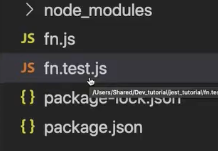

# Jest 


## Jest로 테스트 하는 방법

<br />

{: .note-title } 
Jest 설치 (1)

```bash
$ npm install jest --save-dev
```

{: .note }
package.json 파일 수정 -> script:"jest" (2)

```.json
{
    "name":"jest ...",
    "version": "1.0.0",
    "main": "index.js",
    "script": {
        "test":"jest"
    }
    ...
}
```

{: .note }
테스트할 파일 .test.js로 생성 (3)


{: .note }
> - 테스트 코드 작성 (4)
>   - `expect` : 검증할 값 삽입
>   - `toBe` : 기대되는 값 삽입

```js
//fn.js 일반 파일
const fn = {
    add:(num1,num2) => num1 + num2,
}
module.export = fn;


//fn.test.js 테스트 파일
//테스트할 함수를 불러온다
const fn = require('./fn');

// 1번째 테스트
test("1은 1이야.", ()=>{
    expect(1).toBe(1);
})

// 2번째 테스트
test("2더하기 3은 5야.", ()=>{
    expect(fn.add(2,3)).toBe(5);
})

//3번째 테스트
test("3더하기 3은 5가 아니다.", ()=>{
    expect(fn.add(2,3)).not.toBe(5);
})
```

{: .note }
`npm test`로 테스트를 실행한다.

<br />
<br />
<br />

---

## toEqual, toStrictEqual

{: .note }
> - `동일한지 확인하는 함수`
>   - 객체의 내용이 같더라도 서로 다른 메모리에 있는 객체이기 때문에 toBe를 쓰면 false가 나온다
>
> - `toBe`
>   - obj가 같은 객체를 가르키고 있는지 확인한다.
>
> - `toEqual`
>   - 객체의 내용이 같은지 확인 할때 사용
>
> - `toStrictEqual`
>   - 객체의 내용이 같은지 확인 할때 사용(`좀 더 엄격하게`)
> 

<br />

```js
// 일반 함수
//fn.js
const fn = {
    makeUser : (name , age) => ({name , age});
}

module.exports = fn;

// 일반 함수 테스트 함수
// fn.test.js
const fn = require("./fn");

test("이름과 나이를 객체로 리턴", () => {
    expect(fn.makeUser("Kim", 30).toEqual({
        name : "kim"
        age : 30
    }))
})

test("이름과 나이를 객체로 리턴", () => {
    expect(fn.makeUser("Kim", 30).toStrictEqual({
        name : "kim"
        age : 30
    }))
})
```

<br />
<br />

---

## toBeNull ,toBeUndefined ,toBeDefined

{: .note }
> - `toBeNull`
>   - Null이면 true
>
> - `toBeUndefined`
>   - Undefined이면 true
>
> - `toBeDefined`
>   - 정의가 되어 있으면 true

<br />

> 간단 예시


```js
const fn = require("./fn");

//null 일 때 Pass
test("null일 때 Pass",() =>{
    expect(null).toBeNull();
})
```

<br />
<br />

---

## toBeTruthy , toBeTruthy

{: .note }
> - `toBeTruthy`
>   - 값이 true면 pass  
>
> - `toBeTruthy`
>   - 값이 false면 pass

<br />

```js
const fn = require("./fn");

// true이면 Pass
test("단어를 합친거는 true",() =>{
    expect(fn.add("hellow","world")).toBeTruthy();
})
```

<br />
<br />

---

## toBeGreaterThan , toBeGreaterThanOrEqual , toBeLessThan , toBeLessThanOrEqual


{: .note }
> - `사용자의 입력글자 및 업로드 파일 크기 제한할 때 사용한다. `
>
> - toBeGreaterThan : 초과
> - toBeGreaterThanOrEqual : 이상
> - toBeLessThan : 작다
> - toBeLessThanOrEqual : 이하

<br />

> 사용 예제 

```js
const fn = require("./fn")

// 
test("id는 10자 이하이어야 한다.", ()=>{
    const id = "abcdefg"
    expect(id.length).toBeGreaterThan(10);
})
```


<br />
<br />

---

## toMatch , toContain(정규 표현식)

{: .note }
> - `정규표현식에 사용 `
>   - `i`를 뒤에 붙이면 대소문자 구별을 하지 않는다.
>
> - `toMatch` : 정규표현식 사용
>
> - `toContain` : 배열에 특정 요소가 포함되는지?
> 

<br />


> 예제 

```js
const fn = require("./fn")

// 글자에 a가 포함되는지 확인
test("hello world에 a가 포함되는지?", ()=>{
    expect("hello world").toMatch(/a/i);
})

// 배열에 특정 요소가 포함되는지?
test("hello world에 a가 포함되는지?", ()=>{
    const List = ["tom" , "Jane" , "Kai"];
    const user = "Mike"
    expect(List).toContain(user);
})

```


<br />
<br />

---

## toThrow (특정 에러가 발생하는지 체크)

{: .note }
> - `특정 에러가 발생하는지 체크`
> 

<br />

> 예제 


```js
const fn = require("./fn")

//"oo"이런 에러를 뱉어내면 Pass
test("에러가 나는지?", ()=>{
    expect(() => fn.throwErr().toThrow("oo"));
})
```


<br />
<br />
<br />

# `비동기 함수에서의 테스트 함수`

{: .new } 
> - 비동기에서의 test 함수
>   - 비동기를 기다리지 않고 끝에 도달하면 바로 Pass 한다
> - `done`를 이용해서 비동기 함수 테스트를 할 수 있다.
>   - 비동기가 끝난 후 `done()`를 실행하면 된다
> - `Promise 반환 시`
>   - `resolves` : 비동기 함수가 Promise를 반환하고 이 `Promise가 해결되면, resolves를 사용하여 해당 Promise의 결과 값을 검사`
>   - `rejects` : 비동기 함수가 Promise를 반환하고 ` 이 Promise가 거부될 때 해당 거부 상태를 검사`

<br />

> 예제 

```js
// fn.js
// 일반 함수
const fn = {
    getName: callback => {
        const name = "Mike";
        setTimeout(()=>{
            callback(name);
        }, 3000);
    }
}
module.exports = fn;

//fn.test.js
// 테스트 함수
test("3초후에 받아온 이름은 Mike", (done)=>{
    function callback(name) {
        expect(name).toBe("Mike");
        //done함수를 이용해서 비동기함수 테스트를 진행 할 수 있다.
        try{
            expect(name).toBe("Mike");
            done();
        }catch{
            done();    
        }
    }
    fn.getName(callback);
})
```

<br />


{: .important-title }
`꼭 return를 적어줘야 한다` (안하면 다 Pass)


> 예제 (promise 반환될때 상황)

```js
// fn.js
// 일반 파일
const fn = {
    getAge: () => {
        const age = 30;
        return new Promise((res,rej) => {
            setTimeout(()=>{
                res(age);
            },3000);
        })
    }
}
module.exports = fn;


//fn.test.js
// 테스트 파일
const fn = require("./fn")

//비동기를 기다린 후 30과 값이 같다면 Pass
test("3초 후에 받아온 나이가 30", ()=>{
    return expect(fn.getAge()).resolves.toBe(30);
})

// async await으로도 테스트 가능
test("3초 후에 받아온 나이가 30", async ()=>{
    const age = await fn.getAge();
    expect(age).toBe(30);
})
```


<br />
<br />
<br />

# 테스트 전후 작업

{: .note-title }
> - 테스트 전후에 변수 초기화
>   - `beforeEach` : 각각의 테스트 전에 실행되는 함수
>   - `afterEach` : 각각의 테스트 이후에 실행되는 함수
>   - `beforeAll` : 현재 파일 처음 시작할 때 실행
>   - `afterAll` : 현재 파일 맨 마지막에 실행되는 함수

<br />

> 예제 코드

```js
//fn.js 일반 파일
const fn = {
    add:(num1,num2) => num1 + num2,
}


// fn.test.js
// 테스트 파일
const fn = require("./fn")

let num = 0;
// 매 테스트 마다 num 값 0으로 초기화
beforeEach(() => {
    num = 0;
})

test("0 더하기 1 = 1", () => {
    num = fn.add(num,1);
    expect(num).toBe(1);
})

test("0 더하기 1 = 1", () => {
    num = fn.add(num,1);
    expect(num).toBe(1);
})
```


