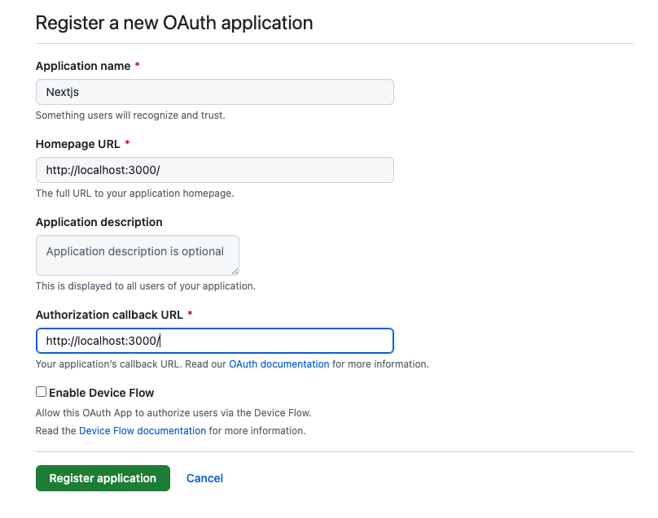
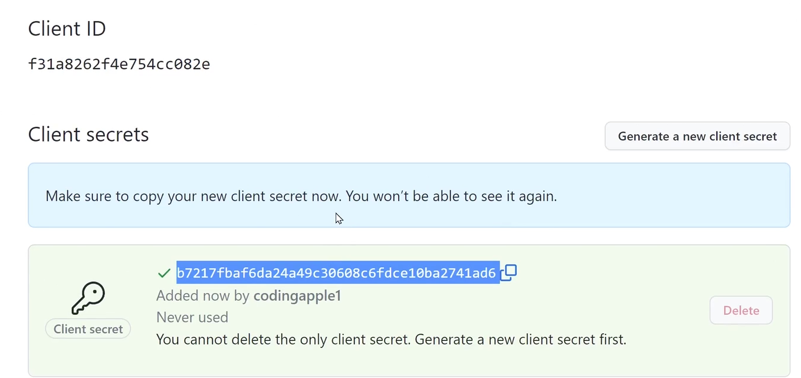
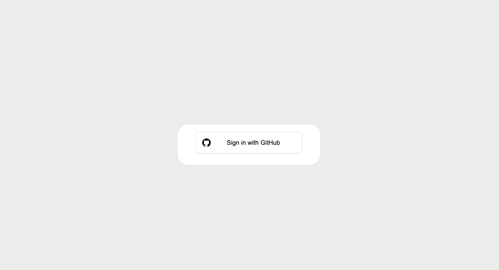
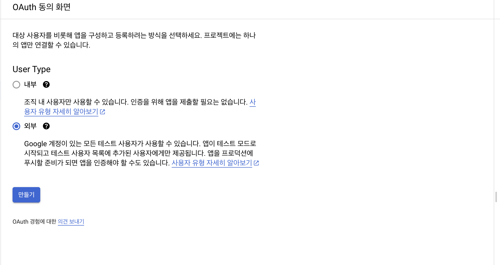
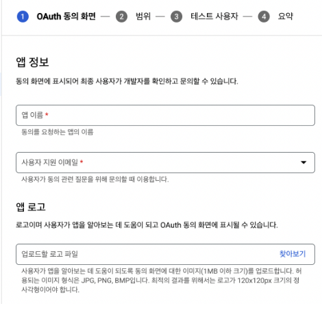
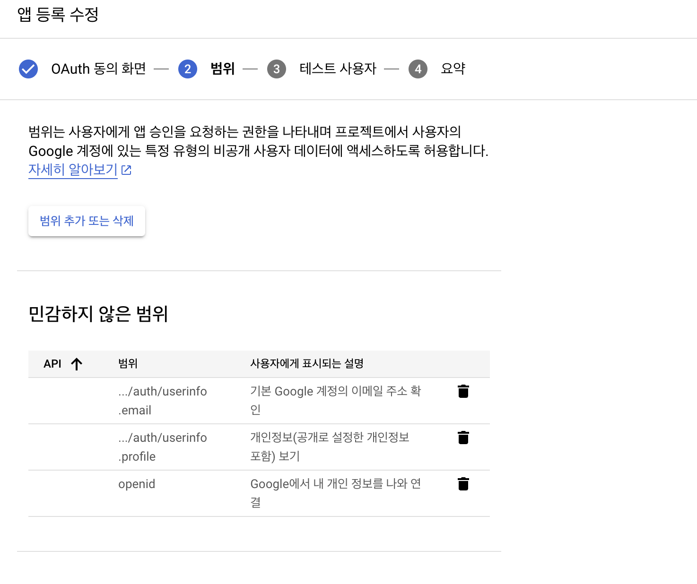
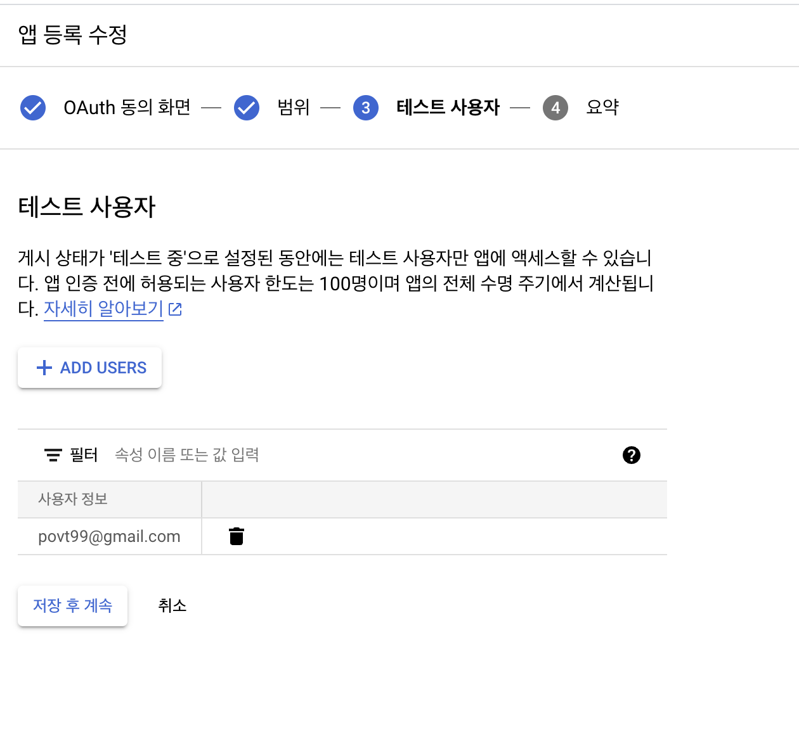
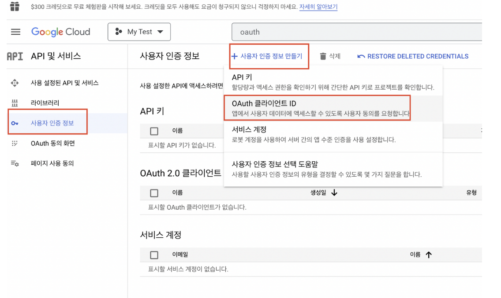
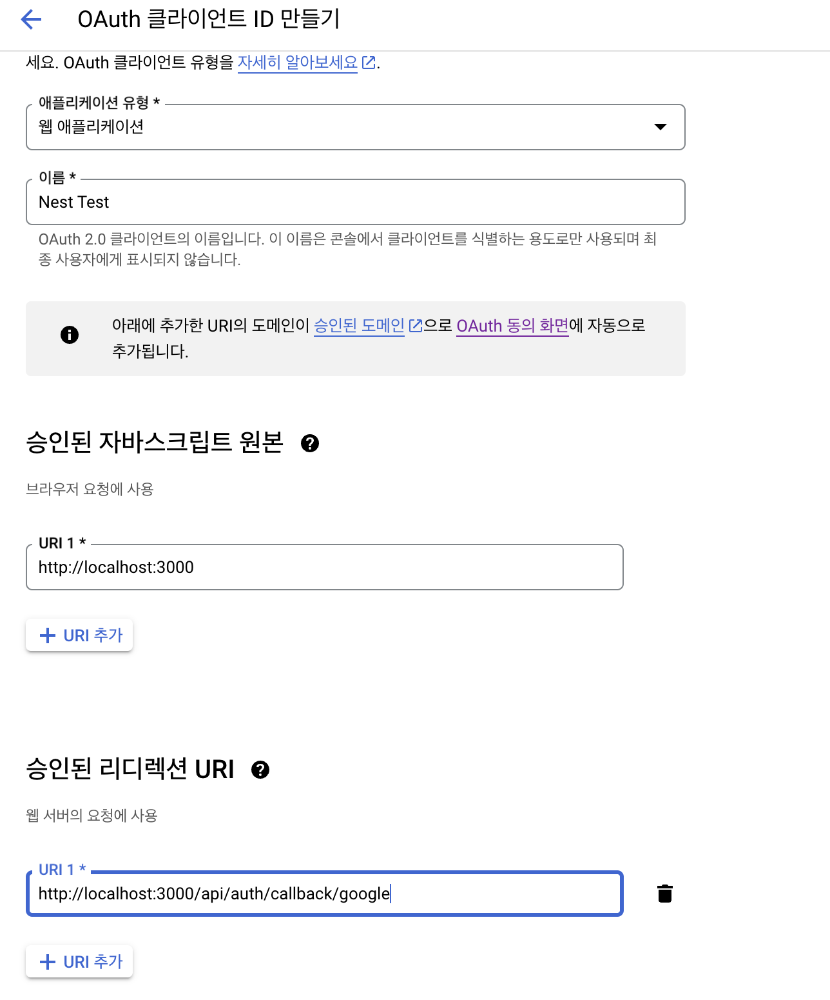
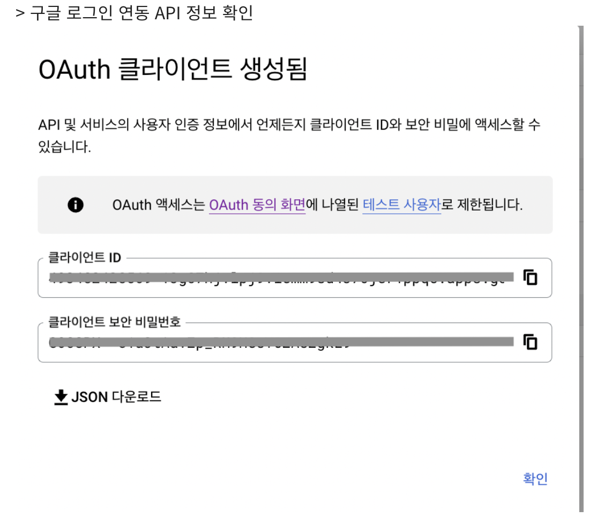

# oauth 소셜 로그인 구현 

## github 어플 등록 및 키값 할당

{: .highlight } 
> - github > setting > developers > Oauth.js Apps 선택

<br />

- 
- 
- 
  - `Generate a new client secret` 선택
- 

<br />
<br />
<br />

## nextjs 사용하기

{: .highlight } 
> - nextjs 설치 하기

<br />

```bash
$ npm install next-auth@4.21.1
```


{: .highlight }  
아래 코드를 참고해서 auth 폴더에 생성

<br />

```js
import NextAuth from "next-auth";
import GithubProvider from "next-auth/providers/github";

export const authOptions = {
  providers: [
    GithubProvider({
      clientId: 'Github에서 발급받은ID',
      clientSecret: 'Github에서 발급받은Secret',
    }),
  ],
  secret : 'jwt생성시쓰는암호'
};
export default NextAuth(authOptions); 
```


<br />
<br />


---

## _app.js 감싸주기

{: .highlight }  
> - app.jsx감싸주기


<br />

```jsx
import { SessionProvider } from "next-auth/react";
import { AppProps } from "next/app";

const MyApp = ({
  Component,
  pageProps: { session, ...pageProps },
}: AppProps) => {
  return (
    <SessionProvider session={session}>
      <Component {...pageProps} />
    </SessionProvider>
  );
};

export default MyApp;

```

<br />
<br />

---

## github 소스 코드 구현

{: .highlight }  
아래 코드를 참고해서 auth 폴더에 생성

<br />





```js
import { signIn, useSession } from "next-auth/react";
import { NextPage } from "next";

const Login: NextPage = () => {
  const { data: session, status } = useSession();

  if (status === "loading") return null; // Loading state

  console.log("Session: ", session);

  return (
    <div>
      <button
        type="button"
        onClick={() => {
          signIn();
        }}
      >
        깃허브 로그인
      </button>
    </div>
  );
};

export default Login;
```


{: .important-title }
> - jwt 방식 끝

<br />
<br />
<br />
<br />
<br />
<br />


--- 


<br />
<br />
<br />

## google oauth 구현 (1)

<br />

{: .highlight } 
> - 아래 그림을 따라가면서 client , secret id 
> - 앱 정보 입력 후 저장 (필수 데이터만 입력, `앱 도메인 및 홈페이지 정보는 해당 단계에서 작성하지 않아도 됨`)
> - 범위
>   - 구글에 원하는 정보 `scope 등록`
> - 테스트 사용자
>   - Google 로그인 테스트를 위한 계정 추가 (`누구나 사용하기 위해선 별도 애플리케이션 심사 필요`)

<br />

- 
- 
- 
- 
- 

{: .highlight } 
> - 어플리케이션 생성 완료

<br />
<br />

--- 

## google oauth 구현 (2)

<br />

{: .highlight } 
> - client id 등등 구하기
> - 사용자 인증 정보 탭에서 OAuth 클라이언트 ID 생성
>   - 승인된 자바스크립트 원본 항목에 `구글 로그인을 사용할 홈페이지 주소` 입력
>   - 승인된 리디렉션 URI 항목에 `구글 로그인 후 Redirect할 주소` 입력

- 
- 
- 